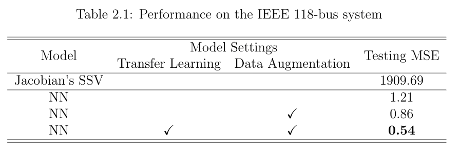
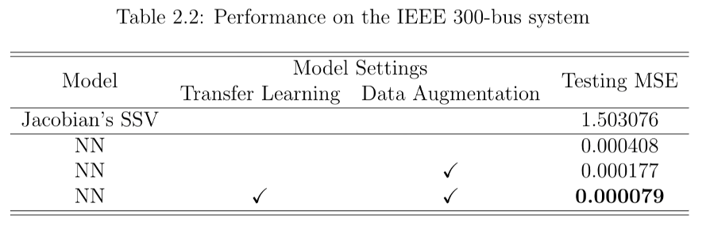

# Learning to infer voltage stability margin suing transfer learning
Preventing voltage collapse is critical for the reliable operation of the power grid. The voltage stability margin is efficiently estimated using a data-driven machine learning approach. The key idea is to train a neural network classifier to learn the boundary of the potentially nonconvex stability region, and exploit the resulting score metric as the regressor for stability margin prediction. No particular loading direction is assumed, but rather the minimum distance to the boundary along all possible directions is captured. The training samples are generated from both continuation and semidefinite relaxation power flow methods. The performance and computational advantage of the proposed approach are verified by numerical experiments.

Paper is available online: http://www.ece.sunysb.edu/~yzhao/LZLK_DSW19.pdf

If you find this repository useful, please consider citing our paper:
```
@inproceedings{li2019learning,
  title={Learning to infer voltage stability margin using transfer learning},
  author={Li, Jiaming and Zhao, Yue and Lee, Young-hwan and Kim, Seung-Jun},
  booktitle={2019 IEEE Data Science Workshop (DSW)},
  pages={270--274},
  year={2019},
  organization={IEEE}
}
```

# Results
We employ a widely used voltage stability margin approximator --- the smallest singular value (SSV) of the Jacobian matrix from running power flow algorithms as the benchmark method. (Code for benchmarking is not included.) The following results show that our models largely improve margin estimation error on 2 demonstrative power systems.



# Requirements
- Tensorflow == 1.14